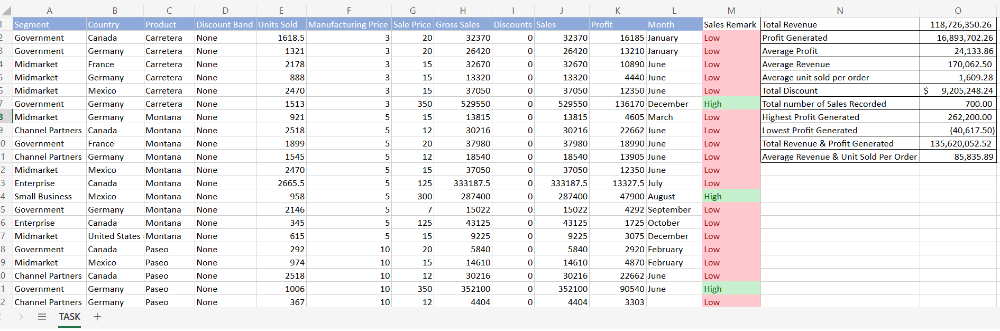

# EMPLOYERS-DETAILING-SALES-DATASET

# Task 1
## With the ongoing 3rd Cohort of the Data Analysis Training with Chinonso,We were presented with our first exciting task 

# Introduction
- This is a dataset showing employers detailing..
- Employer ID
- Employee Full Name
- Department (Communications, Sales, I.T)
- Salary (between $5000 to $25000)
- Job type (Part-time, Freelance, Contract)

  ### Worksheet 1
  Shows only employees who are ‘Freelancers’ and highlight the ones whose salaries are above $10000

### Worksheet 2
shows the spliting of the employees’ full names into first name and last name

### Worksheet 3
 Shows employees whose names begin with the letter ‘E’ (in yellow),Salary column such that the highest SALARY has a green background and the lowest SALARY has a red background.

# Skills Demonstrated
- 1. Filters usage
  2. Data Manioulation
  3. Use of Conditional Formatting
  4. Text to Column

  # Task 2
  ## Second live session class and yet another exciting task presented

  # Introduction
  This is a Sales Dataset containing
  - Segment
  - Country (where goods are sold)
  - Particular Products
  - Discount Band
  - Units Sold
  - Manufacturing Price
  - Sale Price
  - Gross Sale
  - Discounts
  - Sales
  - Profit
  - Month

    ### Worksheet
    Shows
- The total Revenue and Profit generated
- The average Revenue and Units Sold for every order
- The total Discount given in $
- Total number of sales recorded
- The highest Profit generated
- Column named ‘Sales Range’, return ‘High Sales’ if the Sales value is above average, otherwise, return ‘Low Sales’.
  
  

# Skills Demonstrated
Use of Formulas like SUM,AVERAGE,COUNT,MAX and MIN

# Task 3
## Third Live session class and more exciting task presented

# Introduction
Same Dataset used in Task 2

## Worksheet
Shows
- The average revenue generated from each sale of ‘Paseo’
- The number of sales made in the Government and Midmarket segment
- The total revenue generated from the sales of ‘Montana’ in Canada
- Country, Segment and Month with the highest unit of goods sold
- The total profit made in December

# Skills Demonstrated
Use of advanced formulas like SUMIF,AVAERAGEIF,SUMIFS,MAX and XLOOKUP

# Conclusion
The tasks are noteworthy and quite revealing and can't wait to work o more and even bigger projects
